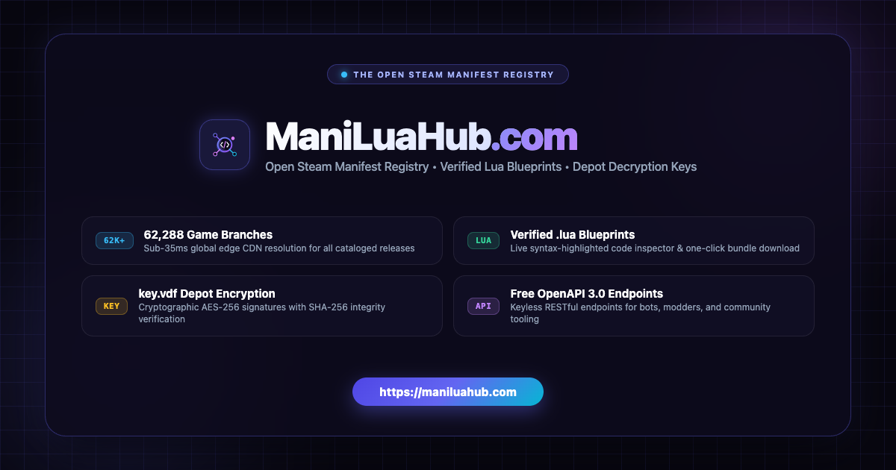

<div align="center">



# 🌐 ManiLuaHub (`manilua-hub`)

**The Open-Source Steam Manifest & Lua Script Ecosystem powering [ManiLuaHub.com](https://maniluahub.com).**

[](https://maniluahub.com)
[](https://github.com/manilua-hub)
[](https://maniluahub.com/explore)
[](https://maniluahub.com/docs)
[](LICENSE)

<p align="center">
  <a href="https://maniluahub.com">🌐 <b>Official Web Portal (官方网页端)</b></a> •
  <a href="https://github.com/manilua-hub/ManifestHub3">⚡ ManifestHub3 Dataset</a> •
  <a href="https://maniluahub.com/explore">🎮 Manifest Catalog</a> •
  <a href="https://maniluahub.com/docs">🔌 OpenAPI Docs</a> •
  <a href="https://maniluahub.com/how-to-use">📖 Tutorial (使用教程)</a> •
  <a href="https://maniluahub.com/download">💻 Client Center</a> •
  <a href="https://maniluahub.com/faq">❓ FAQ</a>
</p>

</div>

---

> [!TIP]
> ### ⚡ 官方 Web 探索器现已上线！
> ### Official Web Explorer & Code Inspector is Live!
> 
> 无需本地克隆 62,000+ 个 Git 分支，直接在网页端秒级检索、代码审查与一键打包下载：
> 
> 👉 **[立即体验 ManiLuaHub.com (Launch Web App)](https://maniluahub.com)**
> 
> - 🔍 **瞬时搜索**：支持游戏中文名、英文名及 Steam AppID 极速检索。
> - 👁️ **透明代码审计**：在线查看语法高亮的 Lua 清单蓝图与 Depot 解密密钥树。
> - 📦 **一键打包**：直接下载免配置的 `<AppID>.lua` 与 `key.vdf` ZIP 压缩包，解压即用。
> - 🔌 **免费 OpenAPI**：为机器人、社区工具及自动化脚本提供毫秒级 JSON 接口。

---

## 🧭 About ManiLuaHub / 组织简介

**ManiLuaHub** is an open-source, community-driven platform dedicated to organizing, indexing, and serving Steam depot manifests, verified Lua automation blueprints, and developer-friendly data services for more than **62,257+ games and DLCs**.

Our goal is to make Steam manifest discovery **transparent, decentralized, auditable, and lightning-fast** for researchers, game archivists, and loader tool developers worldwide.

---

## 🏛️ Ecosystem Overview / 生态架构

The ManiLuaHub organization orchestrates several interconnected repositories and services:

| Repository / Service | Description | Tech Stack | Status |
| :--- | :--- | :--- | :--- |
| **[`manilua-hub/ManifestHub3`](https://github.com/manilua-hub/ManifestHub3)** | Decentralized Git storage indexing 62,257+ Steam titles via branch-per-AppID architecture | Git, VDF, Lua | 🟢 Active |
| **[`manilua-hub/maniluahub.com`](https://maniluahub.com)** | High-performance web portal with live syntax inspection, depot tree browser, and one-click ZIP packaging | Next.js, React, Tailwind CSS | 🟢 Active |
| **[OpenAPI Edge Gateway](https://maniluahub.com/docs)** | Global edge API resolving manifest branches and raw data streams under 35ms latency | Cloudflare Workers, Fastly CDN | 🟢 Active |
| **[`manilua-hub/manilua-hub`](https://github.com/manilua-hub/manilua-hub)** | Organization entry point, ecosystem documentation, community governance, and shared assets | Markdown, Community RFCs | 🟢 Active |

---

## 💡 Core Principles & Design / 核心设计

```text
               ┌────────────────────────────────────────────────────────┐
               │              ManiLuaHub Community & Web               │
               │   https://maniluahub.com  •  Edge Caching (Cloudflare) │
               └───────────────────────────┬────────────────────────────┘
                                           │
                        ┌──────────────────┴──────────────────┐
                        ▼                                     ▼
      ┌───────────────────────────────────┐ ┌───────────────────────────────────┐
      │   manilua-hub/ManifestHub3        │ │         OpenAPI Services          │
      │   Decentralized Git Registry      │ │   Public REST Endpoints           │
      │   62,257+ AppID Git Branches      │ │   Cloudflare Edge Global Stream   │
      └─────────────────┬─────────────────┘ └─────────────────┬─────────────────┘
                        │                                     │
                        └──────────────────┬──────────────────┘
                                           ▼
                 ┌─────────────────────────────────────────────────┐
                 │       Universal Client & Loader Ecosystem       │
                 │   Watt Toolkit • SteamTools • GreenLuma • Deck   │
                 │   SmokeAPI • Koaloader • Whisky (macOS)         │
                 └─────────────────────────────────────────────────┘
```

- 🔒 **Zero Binary Tampering**: We strictly store and serve human-readable `.lua` blueprints and standard `key.vdf` decryption descriptors. No third-party executables, binaries, or proprietary loaders are ever hosted.
- 🌿 **Branch-per-AppID Storage**: Every Steam game title is isolated into its own independent Git branch (e.g. `730` for *Counter-Strike 2*, `105600` for *Terraria*, `2358720` for *Black Myth: Wukong*), allowing lightweight, pinpoint fetching without multi-gigabyte repository clones.
- ⚡ **Sub-35ms Edge Resolution**: Multi-tiered edge caching powered by Cloudflare Workers ensures instant responses across North America, Europe, and the Asia-Pacific region.
- 🔌 **Developer-First Architecture**: 100% keyless, rate-limit-friendly REST APIs for community bots, CI/CD pipelines, and downloader clients.

---

## 🎮 Universal Client Compatibility / 兼容客户端

ManiLuaHub manifests and scripts are structured for native interoperability with leading Steam utility frameworks:

- **Watt Toolkit (Steam++ / Bimorphism)**
- **SteamTools**
- **GreenLuma** (via standard depot mapping)
- **SmokeAPI & Koaloader**
- **SteamOS / Steam Deck**
- **macOS Whisky & CrossOver**

---

## 🔌 Quick API Usage / API 快速上手

Integrate ManiLuaHub data into your own CLI, Discord/Telegram bots, or utility scripts:

### 1. Search Game Catalog
```bash
curl -s "https://maniluahub.com/api/search?q=cyberpunk" | jq .
```

### 2. Fetch Lua Blueprint
```bash
curl -s "https://maniluahub.com/api/files/1091500/lua" -o 1091500_public.lua
```

### 3. Download Full Manifest ZIP Bundle
```bash
curl -s -O -J "https://maniluahub.com/api/files/1091500/zip"
```

For full OpenAPI 3.0 Swagger specifications and interactive documentation, visit **[maniluahub.com/docs](https://maniluahub.com/docs)**.

---

## 🤝 Contributing & Community / 参与共建

We warmly welcome developers, curators, and gaming enthusiasts to collaborate with us:

- **Submit / Update a Manifest**: Check out the [Contribution Guide](https://github.com/manilua-hub/ManifestHub3/blob/main/CONTRIBUTING.md) to submit a PR with updated AppID branches.
- **Report Outdated Keys**: Open an issue on [ManifestHub3 Issues](https://github.com/manilua-hub/ManifestHub3/issues) with the affected AppID and depot details.
- **Feature Requests & Suggestions**: Feel free to initiate discussions or contribute to the web frontend and API layers.

---

## 📜 Legal & Disclaimer / 免责声明

- **Open-Source License**: All documentation, code, and script registries are distributed under the [MIT License](LICENSE).
- **Trademark Notice**: *Steam*, *SteamOS*, and the *Steam logo* are registered trademarks of **Valve Corporation**. ManiLuaHub is an independent open-source project and is neither affiliated with, endorsed by, nor sponsored by Valve Corporation.

---

<div align="center">

Made with ❤️ by the **ManiLuaHub Community** • **[maniluahub.com](https://maniluahub.com)**

</div>
